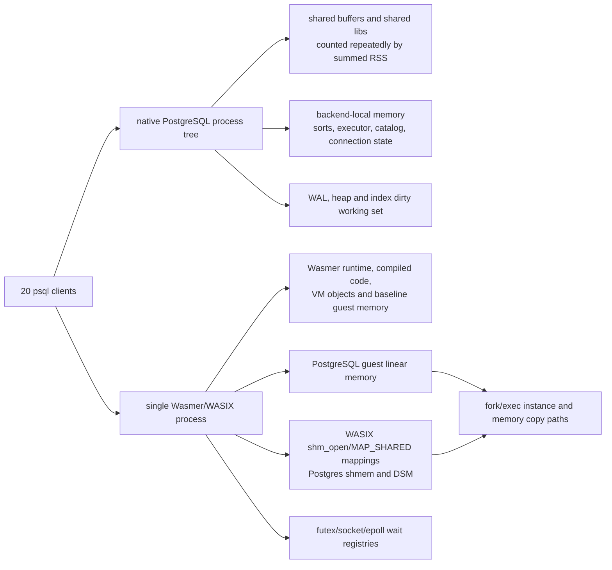

# WASIX PostgreSQL RSS Memory Model

This note explains the current RSS picture for the fresh WASIX PostgreSQL
concurrency work. It separates benchmark measurement artifacts from actual
WASIX overhead, then ranks the memory optimization work by expected return.

## Inputs

Primary benchmark artifacts:

- `assets/wasix-build/work/experiments/fresh-wasix-postgres/reports/concurrent-query-suite/codex-rss-model-c{1,5,10,20}-i5000-after-socket-reissue`
- `assets/wasix-build/work/experiments/fresh-wasix-postgres/reports/concurrent-query-suite/codex-rss-model-c{1,5,10,20}-i50000-after-socket-reissue`
- `assets/wasix-build/work/experiments/fresh-wasix-postgres/reports/concurrent-query-suite/codex-rss-single-indexed-insert-c20-i50000-after-socket-reissue`
- `assets/wasix-build/work/experiments/fresh-wasix-postgres/reports/concurrent-query-suite/codex-futex-diag-indexed-insert-c20-i50000`
- Stalled release samples:
  - `/tmp/codex-indexed-insert-c20-i50000-stuck.sample`
  - `/tmp/codex-indexed-update-c20-i50000-stuck.sample`

RSS collection is process-tree summed `ps` RSS. The harness samples every
process under the server root PID, sums RSS/VSZ/%CPU, and records the peak per
phase. That is useful for one-process WASIX, but native PostgreSQL is a
multi-process postmaster/backend tree, so native summed RSS can double-count
shared mappings. Treat native summed RSS as a conservative upper bound, not PSS.

Relevant harness code:

- `bench-wasix-concurrent-query-suite.sh`: `monitor_resource_usage` sums
  `ps -o rss= -o vsz= -o %cpu=`, and `summarize_resource_usage` keeps per-phase
  peaks.
- Workload operation counts are:
  - `indexed-read`: `connections * (iterations + iterations / 10)`
  - `mixed-write`: `connections * iterations * 2`
  - `indexed-update` and `indexed-insert`: `connections * iterations`

## Short 20-Connection Result

The short 20x5000 run is where the RSS gap looks worst. Sample counts are thin
because the phases are sub-second, but the result is still useful for the fixed
WASIX floor.

| workload | native ops/s | native RSS MiB | WASIX ops/s | WASIX RSS MiB | RSS delta MiB | throughput ratio |
|---|---:|---:|---:|---:|---:|---:|
| indexed-read | 391,459 | 84.5 | 314,286 | 334.5 | 250.0 | 0.80x |
| mixed-write | 709,220 | 60.6 | 615,385 | 303.9 | 243.2 | 0.87x |
| indexed-update | 350,877 | 74.3 | 282,486 | 448.1 | 373.8 | 0.81x |
| indexed-insert | 265,957 | 174.5 | 295,858 | 350.3 | 175.8 | 1.11x |

Readiness baseline from a long single-insert run:

| target | readiness RSS MiB | readiness VSZ GiB | process count |
|---|---:|---:|---:|
| native | 39.0 | 3744.1 | 9 |
| WASIX | 215.1 | 478.2 | 1 |

The robust fixed floor is therefore about `+176 MiB` for WASIX before query
fanout. This floor dominates the short-run RSS ratio.

## Long 20-Connection Result

The long 20x50000 picture is different. Native PostgreSQL also reaches GB-scale
summed RSS on write-heavy workloads. WASIX is not uniquely ballooning on the
completed fair insert comparator.

Completed single indexed-insert, 20 clients x 50000 iterations:

| target | ops/s | peak RSS MiB | peak CPU % | samples | status |
|---|---:|---:|---:|---:|---|
| native | 145,349 | 2161.5 | 628.7 | 45 | completed |
| WASIX | 219,635 | 2394.3 | 579.4 | 31 | completed |

Full 20x50000 matrix:

| target | workload | ops/s | peak RSS MiB | note |
|---|---|---:|---:|---|
| native | indexed-read | 242,879 | 462.0 | completed |
| native | mixed-write | 193,199 | 1183.1 | completed |
| native | indexed-update | 81,222 | 3215.5 | completed |
| native | indexed-insert | 55,685 | 2712.3 | completed |
| WASIX | indexed-read | 181,698 | 674.3 | completed; peak from samples |
| WASIX | mixed-write | 222,321 | 1341.2 | completed; peak from samples |
| WASIX | indexed-update | 91,491 | 3452.3 | completed; peak from samples |
| WASIX | indexed-insert | not completed | 2933.3 | release liveness stall |

The stalled full-matrix indexed-insert phase reached `2933 MiB`, then sat mostly
idle in `epoll_wait` with zero CPU. This RSS should not be used as a completed
throughput/memory point. It is a liveness bug keeping a large active working set
resident.

## Growth Model



The memory picture has four layers:

1. Fixed WASIX floor: about `+176 MiB` over native readiness in these runs.
   This is runtime/compiled-code/guest-memory overhead and applies to every
   workload.
2. Active PostgreSQL working set: table/index/WAL/checkpoint state. This is the
   GB-scale component in long write/update/insert workloads and appears in both
   native and WASIX.
3. Concurrency amplification: more backends dirty and pin more state at the same
   time. In the 50k runs, peak RSS is close to linear in connection count for
   each query family.
4. Liveness retention: if a release run stalls in `epoll_wait` or a futex/latch
   path, the working set does not drain, so RSS stays high even with low CPU.

### Connection Scaling at 50k Iterations

Rough linear fits of peak RSS versus connection count:

| target | workload | slope MiB/connection | intercept MiB | R2 |
|---|---|---:|---:|---:|
| native | indexed-read | 20.9 | 42.5 | 1.00 |
| native | mixed-write | 59.4 | -31.0 | 0.99 |
| native | indexed-update | 170.6 | -345.5 | 0.97 |
| native | indexed-insert | 144.0 | -268.1 | 0.98 |
| WASIX | indexed-read | 22.7 | 220.5 | 1.00 |
| WASIX | mixed-write | 58.5 | 153.8 | 1.00 |
| WASIX | indexed-update | 173.3 | -155.4 | 0.97 |
| WASIX | indexed-insert | 109.2 | 74.8 | 0.95 |

For indexed-insert, including the stalled c20 sample gives WASIX a
`145.9 MiB/connection` slope with `R2=0.98`, nearly identical to native. The
completed c1/c5/c10 points alone show `109.2 MiB/connection`.

This says the long-run slope is mostly workload shape, not a WASIX-only leak.
The WASIX-specific problem is the positive floor/intercept and the liveness
case where RSS stays resident after progress stops.

### Connection Count Versus Total Work

`c1 x 50000` and `c10 x 5000` have the same total operation count for all
single-op workloads, so this comparison isolates connection count better than
the 50k matrix.

| target | workload | c1 x 50k RSS | c10 x 5k RSS | delta | RSS ratio | throughput ratio |
|---|---|---:|---:|---:|---:|---:|
| native | indexed-read | 64.2 | 43.1 | -21.1 | 0.67x | 1.63x |
| native | mixed-write | 69.6 | 43.9 | -25.8 | 0.63x | 2.26x |
| native | indexed-update | 76.9 | 220.0 | 143.1 | 2.86x | 1.80x |
| native | indexed-insert | 69.9 | 64.6 | -5.3 | 0.92x | 2.00x |
| WASIX | indexed-read | 243.0 | 288.9 | 45.9 | 1.19x | 1.87x |
| WASIX | mixed-write | 245.7 | 260.4 | 14.7 | 1.06x | 1.64x |
| WASIX | indexed-update | 261.5 | 433.0 | 171.5 | 1.66x | 1.77x |
| WASIX | indexed-insert | 253.2 | 343.7 | 90.5 | 1.36x | 1.53x |

Read and mixed-write do not show large connection-only memory growth at equal
total work. Indexed-update does. Indexed-insert grows moderately on WASIX.

### Operation Volume at Fixed Connection Count

At one connection, `5k -> 50k` operations barely moves WASIX RSS:

| target | c | workload | RSS 5k -> 50k | RSS ratio | throughput 5k -> 50k | throughput ratio |
|---|---:|---|---:|---:|---:|---:|
| WASIX | 1 | indexed-read | 228.9 -> 243.0 | 1.06x | 65,476 -> 135,802 | 2.07x |
| WASIX | 1 | mixed-write | 229.7 -> 245.7 | 1.07x | 133,333 -> 318,471 | 2.39x |
| WASIX | 1 | indexed-update | 235.5 -> 261.5 | 1.11x | 64,935 -> 134,771 | 2.08x |
| WASIX | 1 | indexed-insert | 233.6 -> 253.2 | 1.08x | 73,529 -> 167,224 | 2.27x |

At 10 and 20 connections, the same 10x operation increase becomes a memory
event, especially for indexed update and insert:

| target | c | workload | RSS 5k -> 50k | RSS ratio | throughput 5k -> 50k | throughput ratio |
|---|---:|---|---:|---:|---:|---:|
| WASIX | 10 | indexed-read | 288.9 -> 448.0 | 1.55x | 253,456 -> 185,999 | 0.73x |
| WASIX | 10 | mixed-write | 260.4 -> 712.0 | 2.73x | 520,833 -> 265,322 | 0.51x |
| WASIX | 10 | indexed-update | 433.0 -> 1345.8 | 3.11x | 238,095 -> 86,192 | 0.36x |
| WASIX | 10 | indexed-insert | 343.7 -> 1222.5 | 3.56x | 255,102 -> 111,458 | 0.44x |
| WASIX | 20 | indexed-read | 334.5 -> 674.3 | 2.02x | 314,286 -> 181,698 | 0.58x |
| WASIX | 20 | mixed-write | 303.9 -> 1341.2 | 4.41x | 615,385 -> 222,321 | 0.36x |
| WASIX | 20 | indexed-update | 448.1 -> 3452.3 | 7.70x | 282,486 -> 91,491 | 0.32x |

So RSS is not simply linear in operations. It is closer to:

```text
RSS ~= fixed_runtime_floor
    + active_connections * per_query_backend_state
    + dirty_heap_index_wal_working_set(connections, operations, checkpoint timing)
    + retained_working_set_if_wait/liveness stalls
```

The write/update cases grow when enough concurrent work is active before the
checkpoint/WAL/heap/index working set can drain.

## Code-Level Evidence

PostgreSQL WASIX shared memory is real MAP_SHARED memory, not a fake in-memory
shim:

- `overlays/wasix-core/src/backend/port/sysv_shmem.c` creates a POSIX
  `shm_open` object, `ftruncate`s it, and maps it with `MAP_SHARED`.
- EXEC_BACKEND reattach uses `mmap(... MAP_SHARED | MAP_FIXED ...)`.
- `fork_process.c` calls `__wasi_proc_fork(1, &wasi_pid)`, so the current
  PostgreSQL fork path asks WASIX for copy-memory fork semantics.

WASIX shared mappings are tracked and replayed:

- `mem_mmap.rs` records `syscall.mem_mmap.bytes`, grows guest memory to cover
  fixed mappings, remaps the range with `remap_shared_file_fixed`, and registers
  shared futex state.
- `WasiState::shared_memory_mappings()` snapshots those mappings for fork/exec.
- `TaskWasm` and linker copied-instance paths replay each shared mapping after
  memory copy.

The current Wasmer VM memory copy path is still not full host COW:

- `Mmap::copy` allocates a new private reserved mapping. The optimized path now
  skips caller-provided excluded ranges and leaves full zero pages untouched in
  copied ranges, but nonzero private guest pages are still copied into a new
  mapping.
- `Memory::copy_to_store` eventually reaches the sys backend copy path. The
  WASIX copied-fork path now uses the excluding variant so known shared mapping
  ranges are not copied before they are replayed with fixed `MAP_SHARED`
  mappings.
- There is a comment in `lib/vm/src/memory.rs` saying the copy path performs
  copy-on-write, but the current VM implementation is sparse/excluding clone,
  not a general COW clone.

Observed perf-stats evidence from `codex-futex-diag-indexed-insert-c20-i50000`:

| counter | calls | total | max |
|---|---:|---:|---:|
| `syscall.mem_mmap.bytes` | 101 | 5426.0 MiB | 142.9 MiB |
| `syscall.fd_write.bytes` | 81,264 | 1174.5 MiB | 3.8 MiB |
| `syscall.fd_read.bytes` | 10,443 | 56.9 MiB | 0.1 MiB |
| `syscall.futex_wait` | 335,100 | 107.8 s | 28.1 ms |
| `syscall.epoll_wait` | 6,859 | 61.2 s | 8.1 s |

The wait-registry dumps during that successful perf-stats run show:

- private futex waiters: 0
- shared futex registries: 3
- common mappings:
  - `149831680` bytes Postgres shared memory
  - small `16384` byte mappings
  - transient `1048576` byte mappings
- epoll subscriptions present with `ready_queue=0` while waiting

That points away from a simple futex-waiter leak in the successful perf-stats
run. It does not exonerate release liveness, because perf-stats changes timing
and the release c20 long-write stalls are real.

## Highest-ROI Optimization Queue

1. Fix the remaining release liveness in the wait registry and socket/epoll
   path. This is the top ROI because stalled runs retain GB-scale active working
   sets and make all RSS conclusions noisy. The next instrumentation should be
   wait-dump-only and release-like: compile-time gated or env-gated, disabled by
   default, and not tied to high-volume perf counters.

2. Split the WASIX readiness floor with per-mapping memory accounting. The
   fixed `+176 MiB` floor applies to every query and dominates short/interactive
   runs. We need a `vmmap`/per-region snapshot at readiness that attributes RSS
   to compiled code, Wasmer runtime heap, guest linear memory, stacks, and file
   mappings.

3. Replace eager guest-memory copy with progressively more upstreamable
   sparse/COW behavior. The first implemented step skips known shared mapping
   ranges and avoids dirtying full zero pages in copied ranges. This is not yet
   full host COW for all anonymous guest memory; true COW still needs a
   platform VM remap layer or another explicit kernel-backed design.

4. Reduce shared-memory remap churn. `mem_mmap.bytes` totals 5.4 GiB in one
   successful 20-client insert run, with a 142.9 MiB max mapping. We should
   instrument per-call mapping identity, reason, and lifetime, then remove
   duplicate reattach/remap work if it is not semantically required.

5. Tune checkpoint/WAL parameters only after liveness is fixed. Checkpoints and
   dirty index/heap/WAL pressure affect native and WASIX together. Tuning them
   can improve throughput, but it should not be used to hide runtime memory
   accounting problems.

6. Improve native comparison metrics. Summed native RSS is useful but not the
   final fair metric. The next comparison should record PSS/USS or per-mapping
   shared/private attribution where the host supports it; on macOS, use `vmmap`
   snapshots for both native postmaster/backend PIDs and the single WASIX PID.

## Bottom Line

The RSS gap is real, but it is not one thing:

- Short runs are dominated by a fixed WASIX floor of roughly `+176 MiB`.
- Long write/update runs are dominated by PostgreSQL working-set growth that
  appears in both native and WASIX, with similar per-connection slopes.
- The remaining release liveness stalls are still a correctness/performance
  blocker because they retain multi-GB working sets after progress stops.
- The best memory-specific runtime optimization is the guest-memory copy path:
  make fork/exec memory cloning genuinely COW or sparse, and avoid copying
  shared mapping ranges before remapping them.

## Post-Optimization c20 Validation

After the sparse/excluding copy, bounded wait dumps, signal-safe wait handling,
socket readiness, and shared futex mapping lookup changes, the previous
20-connection long-write stall did not reproduce in release-like runs using the
rebuilt perf-stats-capable Wasmer binary:

- Wasmer binary:
  `assets/wasix-build/work/upstream/wasmer/target/perf-stats/release/wasmer`
- Wasmer hash:
  `05b1996f017658cca02ada45df6d262b98ed1e41d674fbd6c6047d1d0ec35bbb`
- WASIX report:
  `assets/wasix-build/work/experiments/fresh-wasix-postgres/reports/concurrent-query-suite/codex-c20-all-50000-post-sparse-waitfix`
- Native comparator:
  `assets/wasix-build/work/experiments/fresh-wasix-postgres/reports/concurrent-query-suite/codex-c20-all-50000-native-comparator-post-sparse-waitfix`

20 connections, 50k iterations per client:

| workload | native ops/s | WASIX ops/s | WASIX/native | native summed RSS MiB | WASIX RSS MiB | RSS delta MiB | native peak CPU % | WASIX peak CPU % |
|---|---:|---:|---:|---:|---:|---:|---:|---:|
| indexed-read | 56,535 | 56,358 | 1.00x | 463.5 | 670.9 | +207.4 | 223.3 | 226.8 |
| mixed-write | 99,602 | 96,688 | 0.97x | 1,101.2 | 1,174.7 | +73.5 | 218.1 | 184.7 |
| indexed-update | 39,831 | 37,793 | 0.95x | 3,234.0 | 3,406.3 | +172.4 | 181.1 | 236.1 |
| indexed-insert | 47,310 | 42,816 | 0.90x | 2,878.9 | 2,781.4 | -97.5 | 228.7 | 219.3 |

All WASIX c20 workloads completed with 20/20 successful clients, zero client
timeouts, and zero epoll interruption counts. The standalone former stall
reproducer, `codex-c20-indexed-insert-50000-post-sparse-waitfix`, also
completed 1,000,000 verified inserts with fanout RSS peaking at 1,957.6 MiB and
falling to 263.0 MiB during verify. This is evidence that the prior c20
multi-GB retained-RSS stall is fixed for this release-like workload matrix.

## Implementation Notes

The first implementation pass adds six concrete pieces:

1. Wait dumps are decoupled from high-volume perf counters. A `perf-stats`
   capable Wasmer build can now set `WASIX_WAIT_DUMP_INTERVAL_MS` and
   `WASIX_WAIT_DUMP_FILE` without setting `WASIX_PERF_STATS=1`. Production
   builds without the feature still compile this to no-ops.
2. The concurrent benchmark can capture expensive memory-map snapshots with
   `--memory-map-snapshots`. It records `vmmap -summary` on macOS, or `pmap -x`
   where available, at readiness and fanout/verify boundaries.
3. Copied-memory fork now carries WASIX shared-memory ranges down into the VM
   copy path. The mmap copy primitive skips those byte ranges before WASIX
   replays `MAP_SHARED | MAP_FIXED` mappings, avoiding the previous
   copy-then-remap waste for PostgreSQL shared memory.
4. The mmap copy primitive now performs sparse zero-page elision for copied
   ranges: full zero host pages are left untouched in the freshly allocated
   destination mapping, so they remain backed by the host zero page instead of
   being dirtied into private RSS.
5. Wait-registry dumps now include per-wait context and are capped by
   `WASIX_WAIT_DUMP_MAX_PER_WAIT` (default `8`, `0` for unlimited), preventing a
   single stuck wait from producing unbounded repeated logs while still leaving
   enough evidence to diagnose the wait site.
6. Shared futex registry resolution now uses the sorted shared-memory mapping
   table to find the containing mapping directly instead of linearly scanning
   every mapping on each futex wait/wake.
