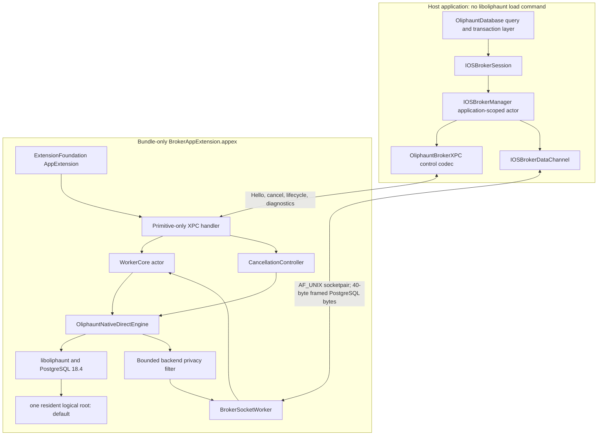

# iOS NativeBroker Technical Feasibility Spike

This report describes the implemented iOS 26 `NativeBroker` spike and its
authoritative exact-source simulator and physical-device qualification. Evidence
is classified as:

- **Implemented**: present in the checked-in Swift/C code.
- **Build-proven**: inspected in an exact simulator or signed device artifact
  used below.
- **Simulator-proven**: asserted by a deterministic fixture lane and accepted by
  its strict report validator.
- **Physical-device-proven**: asserted by the final signed Debug or Release
  fixture on the wired device and accepted by the v2 report validator.
- **Unqualified**: no current listed run proves the behavior.

The authoritative aggregate is
`target/ios-native-broker-full-matrix/simulator-matrix.json`
(`oliphaunt-ios-broker-full-simulator-matrix-v1`). It completed with
`status=PASS` at `2026-08-10T05:35:14Z` on an iPhone 17 Pro simulator running
iOS 26.4. Its four independently built and launched lanes passed 55 checks:
33 semantic, 7 handshake-negative, 10 extended-fault, and 5 hang checks.

The authoritative physical aggregate is
`target/ios-native-broker-device-spike/reports/device-runner-report.json`
(`oliphaunt-ios-broker-device-run-v2`). It completed with `status=PASS` at
`2026-08-10T05:57:28Z` on the wired `iPhone15,2` device named
`Sid Jain’s iPhone`, running iOS 26.5. It contains two signed Debug semantic
launches with 33 checks each and a separate signed Release lifecycle aggregate.
The canonical Release report is
`target/ios-native-broker-device-spike/reports/device-lifecycle-runner-report.json`
(`oliphaunt-ios-broker-device-lifecycle-run-v2`); it passed at
`2026-08-10T05:57:28Z` with two 30-check foreground/background/foreground
launches. No failed or superseded physical artifact is used as passing
qualification evidence in this report.

A separate, final signed-Debug physical hang lane is recorded at
`target/ios-native-broker-device-hang/device-hang-20260810T095852Z-46512/reports/device-hang-runner-report.json`
(`oliphaunt-ios-broker-physical-hang-run-v1`). It completed at
`2026-08-10T09:59:20Z` on the same device. Its evidence contract passed, but
`recoveryProven=false`: it is negative capability evidence, not a passing
hang-recovery claim.

A later DEBUG-only mechanism experiment is retained under
`target/ios-native-broker-recovery-experiments/20260811T060724Z`. It armed and
acknowledged a deadlock, proved the same worker still answered diagnostics,
then triggered the deadlock only after a normal native request registered its
cancellation target. On the physical device, immediate public recreation and a
50 ms delay both reached stale active-channel state; 100 ms and 250 ms delays
each obtained a different PID, fresh epoch, Ready generation, and healthy SQL
response. Private terminate and unique-instance SPI controls also recovered at
zero delay, as did a DEBUG extension-side one-second fail-stop watchdog. These
are causal experiments, not canonical capability qualification: the private
SPI cannot ship, the delay boundary was sampled only once per value, and the
fail-stop policy is not yet a production implementation.

The exact simulator artifact manifest is
`oliphaunt-ios-broker-artifacts-v1`, arm64, iOS 26.0, PostgreSQL 18.4, C ABI 6,
`brokerDatabaseRole=oliphaunt_broker`, and
`selectedExtensions=vector,pg_trgm`. Its SHA-256 fingerprints are:

- dylib: `dc25e809c67b93d7706f49f093857547eaa0daaf96997a90c12bb8303f358a81`;
- XCFramework: `8f87ce2bc10aa25dc9e7b35b9d6cb36bdc3bfea785fa466993e557087512cb48`;
- resources: `35f0803a95ab108a272fb9a3db32f71bf1b1f976b5c6518924dbbe26aa577ebf`;
- template/initdb: `2879a752803678cbf01f8dfad03d5b59e4bbc1d00ec9973fca2a7a7e99426906`.

The semantic lane reported runtime root-manifest digest
`5488f9fa6f756b020c3ca57f92207bded78b6843a2da1beaf78c0af8bde96073`;
the handshake-negative and extended-fault lanes matched it.

The static registry is complete for `vector,pg_trgm`. Build inspection shows no
`liboliphaunt` load command in the host and
`@rpath/liboliphaunt.dylib` only in the app-extension executable. The extension
also contains the runtime, template PGDATA, registry metadata, and matching
control/SQL files for both selected extensions.

## 1. Implemented component diagram



The host discovers a real `AppExtensionIdentity`, starts or attaches through
`AppExtensionProcess`, and retains that process for the generation. `Hello`
atomically transfers one socket endpoint. The extension owns one `WorkerCore`,
one root, and one native PostgreSQL session. There is no listener, loopback TCP,
daemon, downloaded code, `Process`/`NSTask`, private entitlement, or
`NativeServer`.

## 2. Swift types and target/module boundaries

| Module or target | Principal types | Dependency boundary |
| --- | --- | --- |
| `OliphauntBrokerProtocol` | protocol constants, `BrokerFrame`, `BrokerHello`, `BrokerReady`, capabilities, errors, epochs, request IDs, state machines | Pure Swift plus Foundation; no XPC, ExtensionFoundation, `Oliphaunt`, `COliphaunt`, or native runtime. |
| `OliphauntBrokerXPC` | `IOSBrokerXPC`, `IOSBrokerControlEnvelope`, `IOSBrokerWireDiagnostics`, `IOSBrokerOwnedFileDescriptor` | Primitive lightweight-XPC codec and explicit FD ownership. Depends only on the protocol module. It does not import the host manager or extension worker. |
| `OliphauntIOSBroker` | `IOSBrokerConfiguration`, `IOSBrokerEngine`, `IOSBrokerManager`, `IOSBrokerSession`, `IOSBrokerDataChannel` | Host adapter over `Oliphaunt`, the protocol module, and `OliphauntBrokerXPC`; it does not link the prepared native XCFramework. |
| `OliphauntBrokerExtension` | `WorkerCore`, `CancellationController`, `BrokerSocketWorker`, storage, response observer, privacy filter, DEBUG fault injector | Extension implementation over `Oliphaunt`, `COliphaunt`, and the protocol module. It does not depend on the host adapter or XPC codec. |
| `BrokerAppExtension` fixture target | ExtensionFoundation entry point and XPC server | Imports `OliphauntBrokerExtension` and `OliphauntBrokerXPC`, owns native resources, and is the only fixture target that loads `liboliphaunt`. |
| `OliphauntBrokerSpike` fixture target | semantic, handshake-negative, extended-fault, hang, and device-lifecycle fixtures | Uses the public host adapter and emits JSON plus exact PASS/FAIL markers. |

The package exposes `OliphauntBrokerProtocol`, `OliphauntBrokerXPC`,
`OliphauntIOSBroker`, `OliphauntBrokerExtension`, and `Oliphaunt` as separate
products. The fixture is a non-UI custom ExtensionKit extension under
`Extensions/BrokerAppExtension.appex`. Swift 6 strict-concurrency checks cover
the shared state machines, host queueing, XPC wire values, extension recovery,
cancellation order, and exactly-once terminal behavior.

The canonical top-level device report points through
`validations.semanticDebugRetainedProduct` to
`retained-semantic-debug-product.json`
(`oliphaunt-ios-broker-retained-semantic-debug-product-v1`, `status=PASS`). The
validated app is
`target/ios-native-broker-device-spike/retained-semantic-debug.3GeyQ0/OliphauntBrokerSpike.app`;
its extension is the nested
`Extensions/BrokerAppExtension.appex`, and its originating result bundle is
`reports/device-build-20260810T054111Z-58906.xcresult` under the device-spike
target. The runner copied the signed Debug app to a unique retained path before
the Release clean, verified the app and embedded-extension signatures and bundle
IDs, and
recorded executable SHA-256 values. Its lifecycle continuation then failed
closed unless the retained path stayed inside the device-build root, the
extension and result-bundle paths matched, both signatures remained valid, and
both executable hashes still matched. The retained host hash is
`b5ee74ec19b49670f3d94d9ee3af876cf3e43c5915e7fd77f7500e68db064d0f`; the
retained extension hash is
`ea28d943c448cde92e09baaab09ffd3ddd44870d6b06e5eb931f33c518a4a07c`.

The final arm64 iPhoneOS Release artifact was built, archived, installed, and
launched from the archive. Recursive signing inspection found matching
development-team identities on the app, extension, and native framework. The
host has no `liboliphaunt` load command; the extension loads
`@rpath/liboliphaunt.framework/liboliphaunt`. The containing app embeds exactly
one framework, the extension embeds no duplicate framework, and no loose
`liboliphaunt.dylib` exists. Symbol audits found no host-only
`IOSBrokerManager`/`IOSBrokerEngine`/`IOSBrokerSession` implementation in the
extension. The Release app/extension audit excluded implementation symbols
matching `BrokerFaultInjector`, `WorkerCore.*injectFault`,
`IOSBrokerSession.*injectFault`, `ExtendedFaultMatrix`, and `HangFaultMatrix`.
Shared `BrokerWorkerFault` protocol enum types remain intentionally present.

Exact Release product sizes were 58,549,340 bytes for the app bundle, 43,535,644
for the extension bundle, 12,726,496 for the native framework, 41,943,411 for
runtime resources, 1,656,944 for the host executable, and 1,085,264 for the
extension executable.

## 3. Exact XPC control-message schema

Every control value is an `XPCDictionary`. Scalars are `String`, `UInt64`,
`Int64`, or `Bool`; structured values are ordinary `JSONEncoder` JSON strings.
`dataChannel` is a real `XPC_TYPE_FD`. PostgreSQL bytes never travel over XPC.

### Handshake

| Direction/kind | Required fields | Optional fields |
| --- | --- | --- |
| Host → extension, `hello` | `message`, `minimumProtocolVersion`, `maximumProtocolVersion`, `expectedABI`, `rootID`, `startupConfigurationDigest`, `requestedCapabilities`, `dataChannel` | `expectedRuntimeVersion` |
| Extension → host, `ready` | `message`, `selectedProtocolVersion`, `epoch`, `extensionPID`, `runtimeVersion`, `abiVersion`, `postgresMajorVersion`, `rootManifestDigest`, `actualCapabilities`, `actualRuntimeConfiguration` | none |
| Extension → host, `rejected` | `message`, `error`, `reason` | legacy `rejection` only as a compatibility fallback |

The current fixture requests protocol `1...1`, ABI 6, root `default`, startup
digest `ios-native-broker-spike-v2-restricted-role`, and capabilities
`processIsolated`, `crashRestartable`, `sameRootLogicalReopen`, `protocolRaw`,
`protocolStream`, and `queryCancel`. Runtime version is not pinned. The worker
returns the actual root identity, startup digest, extensions, and
`smallMobile` footprint in `actualRuntimeConfiguration`.

The host rejects protocol, ABI, optional runtime, root, digest, extension,
capability, and negative single-root/single-session mismatches. Before launch it
also rejects any broker database configuration that supplies a filesystem root,
unsafe durability, a non-`smallMobile` footprint, custom startup GUCs, or a
non-default public username/database. Unsupported public fields are not dropped.

### Lifecycle and diagnostics

Established-worker controls carry `message` and the expected `epoch`.
`requestID` is monotonic when supplied and is mandatory for `cancel`.

| Request kind | Additional fields | Successful reply |
| --- | --- | --- |
| `cancel` | `requestID` | `message: "cancel"` or `"cancelObserved"`; `success: true` |
| `checkpoint` | none | same `message`; `success: true` |
| `prepareForBackground` | `deadlineUnixNanoseconds` | same `message`; `success`, `cancelledActiveWork`, `checkpointed` |
| `resumeFromBackground` | none | same `message`; `success: true` |
| `detach` | none | same `message`; `success: true` |
| `diagnostics` | none | fields below |
| `injectFault` | `fault` | same `message`; `success: true`; DEBUG only |

A diagnostics reply contains `message`, `success`, `state`, `epoch`,
`extensionPID`, optional `manifestDigest`, optional `activeRequestID`,
`nativeDispatchStarted`, `transactionStatus`, `capabilities`, optional
`currentPhysFootprintBytes`, optional `currentResidentBytes`, optional
`availableMemoryBytes`, `checkpointInProgress`, optional
`storageProtectionEvidenceJSON`, and the four optional
`extensionEntryPreOpen*`/`openedIdle*` memory fields. A completed checkpoint may
also include the all-or-nothing historical tuple
`checkpointMemorySampleSequence`,
`checkpointMemorySampleStartedAtUptimeNanoseconds`,
`checkpointMemorySampledAtUptimeNanoseconds`,
`checkpointMemorySampleCompletedAtUptimeNanoseconds`,
`checkpointMemorySamplePhysFootprintBytes`,
`checkpointMemorySampleResidentBytes`, and
`checkpointMemorySampleAvailableMemoryBytes`. The public host diagnostic adds
manager-only `logicalHandleCount`, `queuedOperationCount`,
`launchAttemptCount`, `launchCount`, `interruptionCount`, and
`admissionsPaused`; those fields are not claimed as worker XPC fields.

All boundary failures are encoded as structured `BrokerError` JSON. Path-bearing
or unconstrained internal errors are mapped to a small path-free reason set
before crossing XPC. `attachDataChannel` is reserved and rejected in v1 because
the FD is part of `Hello`. Host attempts to send `ready`, `rejected`, or
`cancelObserved`, malformed numeric values, invalid UUIDs, unknown faults, or
wrong-epoch controls are protocol errors.

## 4. Exact 40-byte wire-frame definition

All integers use network byte order; UUID bytes are the canonical 16 raw bytes.

| Offset | Size | Field | Rule |
| ---: | ---: | --- | --- |
| 0 | 4 | magic | ASCII `OLPB` (`4f 4c 50 42`) |
| 4 | 2 | protocol version | UInt16; v1 is `1` |
| 6 | 2 | header length | UInt16; exactly `40` |
| 8 | 1 | frame type | UInt8 enumeration below |
| 9 | 1 | flags | UInt8; known mask is zero |
| 10 | 2 | reserved | UInt16; must be zero |
| 12 | 16 | epoch | current worker UUID |
| 28 | 8 | request ID | UInt64; nonzero for request frames, zero otherwise |
| 36 | 4 | payload length | UInt32; at most 256 KiB |

| Value | Type | Request ID | Payload |
| ---: | --- | --- | --- |
| 1 | `requestBegin` | nonzero | empty |
| 2 | `requestBytes` | nonzero | PostgreSQL frontend bytes |
| 3 | `requestEnd` | nonzero | empty |
| 4 | `responseBytes` | nonzero | PostgreSQL backend bytes |
| 5 | `completed` | nonzero | empty |
| 6 | `rejected` | nonzero | encoded `BrokerRejectionReason` |
| 7 | `outcomeUnknown` | nonzero | optional path-free detail |
| 8 | `cancelRequested` | nonzero | empty; XPC is the normal path |
| 9 | `cancelObserved` | nonzero | empty |
| 10 | `ping` | zero | empty |
| 11 | `pong` | zero | empty |
| 12 | `protocolError` | zero | path-free UTF-8 detail |
| 13 | `channelClose` | zero | empty |

The decoder rejects bad magic/version/header/type/flags/reserved values, stale
epochs, invalid request-ID domains, oversized payloads, overflow, truncation,
and illegal state transitions before allocating a declared payload. The maximum
frame payload is 256 KiB and the shared active-plus-queued request budget is
8 MiB. The default complete frontend request limit is also 8 MiB.

The C API accepts one complete frontend-protocol request, so v1 validates and
assembles fragments before dispatch. It truthfully reports
`streamingRequestInput=false`. Backend bytes stream directly. The native stream
queue has a 4 MiB default hard ceiling and splits a larger backend write into
ordered pieces before allocation. A native smoke test forces a 1,024-byte
ceiling over a response larger than 64 KiB and validates exact PostgreSQL bytes.

The nonstreaming `execProtocolRaw` path is bounded too:
`IOSBrokerConfiguration.maximumRawResponseBytes` defaults to 8 MiB, may not
exceed the transport bound, and its collector throws and discards its partial
buffer on overflow. Large results must use `execProtocolStream`.

## 5. Request and worker state machines

### Host generation

```text
unavailable
idle -> launching -> binding -> ready(epoch)
interrupted(oldEpoch) -> recovering -> binding -> ready(newEpoch)
ready(epoch) -> quiescing(epoch) -> ready(epoch)
ready(epoch) -> closing -> idle
launch/discovery failure -> unavailable | idle | interrupted(oldEpoch)
```

`IOSBrokerManager` owns the retained process, XPC session, socket, epoch,
process-monotonic request-ID source, logical handles, FIFO, shared input budget,
in-flight registry, transaction owner, and recovery counters. SQL work is FIFO.
A `ReadyForQuery(T/E)` pins the transaction to its logical handle and
`ReadyForQuery(I)` releases it.

### Worker

```text
created -> starting -> ready
ready -> quiescing -> ready
ready | quiescing -> interrupted
ready -> detached
starting | ready | quiescing -> failed(reason)
interrupted | detached -> starting with a fresh epoch
```

`WorkerCore` has one active request and explicit reentrancy guards. Every start
owns a token revalidated after storage preparation, native open, restricted-role
bootstrap, capability validation, and health check. An interrupted suspended
open therefore cannot publish itself as the replacement generation.

### Request

```text
queued -> receiving -> readyToDispatch -> running -> terminal(completed)
queued | receiving | readyToDispatch -> terminal(canceled)
running -> cancelRequested -> terminal(completed | outcomeUnknown)
host-queued loss before any write -> terminal(notStarted)
loss after bytes may have reached the worker -> terminal(outcomeUnknown)
```

Each host operation has one checked continuation and one guarded terminal bit.
Terminal cleanup removes it from queue/in-flight state, cancels deadline tasks,
releases its reservation, and resumes exactly once. Request IDs never reset when
epochs change.

## 6. Descriptor ownership rules

1. The host creates `socketpair(AF_UNIX, SOCK_STREAM, 0, ...)` and initially owns
   both descriptors.
2. It sets `FD_CLOEXEC`, `O_NONBLOCK`, and `SO_NOSIGPIPE` on both endpoints.
3. `IOSBrokerDataChannel` adopts the host endpoint; `DispatchIO` closes it from
   its cleanup handler.
4. `xpc_fd_create` boxes a duplicate of the extension endpoint. No bare integer
   FD crosses the control boundary.
5. The receiver calls `xpc_fd_dup`; `IOSBrokerOwnedFileDescriptor` owns the new
   descriptor until it transfers ownership once to `BrokerSocketWorker`.
6. The host closes its original extension endpoint only after a worker reply
   proves transfer. Every failure path closes what it still owns.
7. The extension reapplies `FD_CLOEXEC`/`SO_NOSIGPIPE`, clears `O_NONBLOCK`, and
   uses bounded blocking I/O on its private queue. Its socket send-buffer target
   is 512 KiB and there is no second unbounded Swift response queue.
8. Interruption shuts down the epoch socket, cancels XPC, and invalidates the
   retained `AppExtensionProcess`; cleanup is idempotent.
9. The descriptor is bound to its `Hello` epoch. Header validation prevents it
   from being attached to a later generation.
10. Graceful old-socket cleanup calls `detach(expectedEpoch:)`; channel tokens
    and XPC session IDs prevent stale cleanup from detaching a replacement.

## 7. Completion and OutcomeUnknown semantics

`completed` proves only that framed transport ended normally. SQL success or
failure is carried in ordinary PostgreSQL backend bytes. A PostgreSQL
`ErrorResponse` is followed by `ReadyForQuery` and then `completed`; the existing
`OliphauntDatabase` parser turns those synchronized bytes into the typed SQL
error.

The host does not trust `completed` alone. Its incremental observer requires a
structurally complete stream whose last completed backend message is
`ReadyForQuery(I/T/E)`. The worker independently requires a valid terminal
`ReadyForQuery`. Missing, malformed, truncated, or nonterminal output tears down
the epoch and returns `outcomeUnknown` after possible dispatch.

`rejected` is restricted to proven pre-dispatch rejection. `notStarted` is used
only when the host proves no request bytes reached a worker. After the first
possible write or native dispatch, any loss before `completed` yields
`BrokerError.outcomeUnknown(epoch, requestID)`: crash, XPC interruption, EOF,
malformed output, consumer failure after chunks, native failure without proof,
or commit followed by loss of the terminal frame.

There is no SQL classification and no automatic replay. A bounded raw collector
discards partial data when it throws. A streaming consumer may have seen chunks,
but a final `OutcomeUnknown` means those chunks are incomplete.

The semantic lane deterministically crashed after a committed marker but before
`completed`, returned `OutcomeUnknown`, recovered, and found the marker exactly
once. It separately crashed with an uncommitted marker and found it absent after
WAL recovery. The extended-fault lane additionally observed 4,139 response bytes
in four chunks before a worker crash and still returned the partial-stream
outcome as unknown.

Both final signed Debug device launches repeated the 33-check semantic workload.
Each returned `OutcomeUnknown` for the post-commit fault, recovered the committed
marker exactly once without replay, recovered a separate pre-commit crash, found
the uncommitted marker absent, streamed 2,119,735 bytes in 4,358 chunks, and
completed healthy SQL. That is current iPhoneOS PostgreSQL/WAL evidence, not a
reuse of the earlier device smoke.

## 8. Cancellation race resolution

Queued operations are removed before dispatch and finish once as canceled.
Running cancellation uses XPC. The extension invokes the lock-protected,
nonisolated `CancellationController` before scheduling actor-isolated
`WorkerCore` bookkeeping, so the native signal cannot queue behind the query.

For running work:

1. native cancellation is signaled out of band;
2. the lifecycle is recorded as `cancelRequested` without issuing a second
   native cancel;
3. PostgreSQL produces ordinary backend output;
4. `ErrorResponse` SQLSTATE `57014` proves that PostgreSQL observed cancellation;
5. `ReadyForQuery` restores synchronization; and
6. the worker sends response bytes and exactly one `completed` terminal frame.

The 64 KiB-bounded backend observer extracts only cancellation SQLSTATE and
terminal transaction state; it does not accumulate rows. Cancellation and
completion share one terminal transition. Duplicate or late controls are
idempotent. An acknowledgement proves only observation of the cancel request.

The exact extended-fault close/cancel/completion race used a three-second
`pg_sleep`, below its six-second request deadline, waited for matching host and
worker active IDs plus `nativeDispatchStarted=true`, then closed and canceled
concurrently. Its raw response parsed as PostgreSQL cancellation SQLSTATE
`57014`, the transport still reached `completed`, and the report recorded:

```text
closeCancelCompletionTerminal=postgresCanceledCompleted
closeCancelControlOutcome=acknowledged
```

The validator also permits the control side to lose only to an already closed
database, while still requiring the same PostgreSQL-canceled/completed terminal
result. Deadlines request cancellation, wait a bounded grace period, and
invalidate the epoch when synchronization cannot be recovered.

Both signed Debug semantic launches and both signed Release lifecycle launches
also passed cancellation followed by post-cancel liveness on the physical
device. The exact raw close/cancel/`57014`/`completed` race remains the simulator
extended-fault proof; the device reports do not overstate their higher-level
cancellation checks as a second raw-race capture.

## 9. Crash and hang recovery behavior

Interruption atomically invalidates the launch ID and epoch, shuts down socket
and XPC, clears transaction ownership, completes every operation once, and moves
to `interrupted(oldEpoch)`. Recovery is demand-driven: discover again, create a
new process/XPC/socket generation, reopen root `default`, allow WAL recovery,
then require `ping`/`pong` before admission. No SQL is replayed.

The semantic lane used host PID `55305` and these generations:

| Launch | Cause | Epoch | Worker PID | Result |
| ---: | --- | --- | ---: | --- |
| 1 | Initial open | `fff65828-f5af-41d5-b155-8644580e3d31` | `55318` | Separate from host; normal workload. |
| 2 | Logical detach/reopen | `8e1711b6-4ae1-4dfc-80fe-2b885746dbb7` | `55318` | Fresh epoch in the same OS process. |
| 3 | Post-commit crash recovery | `facac562-1ceb-4fcc-9a85-c8fd43dd1856` | `55384` | Fresh process; committed marker present once. |
| 4 | Pre-commit crash recovery | `2ce33ccd-9a52-4647-9c65-bc3d1729f21d` | `55393` | Fresh process; uncommitted marker absent. |

The extended-fault lane used host PID `56963`, initial worker PID `56972`, and
five fresh recovery epochs:
`730dc392-b58c-4ee0-ba73-887e02e978b7`,
`dd69f26c-1f7a-44b2-906c-befa936f146e`,
`1bfb141e-8a9a-4b28-af69-5d72afd0b1f8`,
`54317682-f6cf-4186-bec2-66ef9f06e663`, and
`dd8a3fe3-5657-40de-9837-317aa0b51c4e`; its final worker PID was `57024`.
It covered crashes before dispatch, after response chunks, during checkpoint,
and while idle via abort and SIGSEGV, plus different-root and archive-boundary
rejection.

Hang behavior was measured conservatively. Host PID `57602` attached to worker
PID `57611` at epoch `9f3733c2-5f70-4e2c-98ef-7d4771891c4d`. The main actor
remained responsive, the old epoch was invalidated, calls failed with
`workerInterrupted`, and one replacement launch was attempted. The system did
not supply a successful new generation or fresh process:

```text
replacementLaunchAttemptDelta=1
successfulLaunchCountDelta=0
freshProcessObtained=false
hangRestartableCapability=false
```

This is a passing conservative result, not a hang-restart claim.

The dedicated physical lane then ran the same deliberate deadlock last, using
the retained signed Debug artifact. Host PID `7110` attached to worker PID
`7112` at epoch `69502c5d-eb5c-4f2c-842c-930060230881`. The host main actor
remained responsive, the request terminated as `workerInterrupted`, the old
epoch was invalidated, and the post-hang health operation caused one actual
replacement initializer attempt. The counters were again:

```text
initialWorkerPID=7112
replacementLaunchAttemptDelta=1
successfulLaunchCountDelta=0
freshProcessObtained=false
recoveredEpochs=[]
hangRestartableCapability=false
```

The console and app-container reports were semantically identical, the
`devicectl` host PID matched, and the exact signed app, installation URL, launch
executable, device, and process identities were cross-checked. Thus physical
deliberate-hang recovery is no longer merely untested: no fresh healthy worker
was obtained in this bounded iPhone15,2/iOS 26.5 observation. This verifies the
current v1 product limitation, but one immediate failed replacement attempt on
each tested stack does not prove that every retry policy or every iOS 26 device
must fail.

The follow-up mechanism experiment removed that earlier observability gap. The
fault-control request now only arms the DEBUG deadlock and returns an
acknowledgement. Same-PID/same-epoch diagnostics then prove `WorkerCore` remains
responsive. The next ordinary query registers the native cancellation target
before entering the non-returning zero-count semaphore wait under actor
isolation. All public-delay trials observed the expected `outcomeUnknown` after
roughly six seconds and an interruption-count increase, proving the armed
deadlock—not merely the control request—caused the invalidation.

The physical public-delay results were:

| Configured / actual delay | Initial -> recovered PID | Ready delta | Result |
| ---: | --- | ---: | --- |
| 0 / 0 ms | `8976` -> none | 0 | Stale process/session rejected the recovery query because a broker data channel was still active. |
| 50 / 52 ms | `9006` -> none | 0 | Same stale active-channel result. |
| 100 / 106 ms | `9009` -> `9010` | 1 | Fresh epoch and healthy SQL response. |
| 250 / 265 ms | `8979` -> `8980` | 1 | Fresh epoch and healthy SQL response. |

This local boundary is evidence of asynchronous teardown and process reuse, not
a documented or reliable 100 ms platform threshold. The zero-delay controls
make the causal distinction sharper: private unique-instance acquisition
recovered `8986` -> `8987`; corrected private termination recovered `8997` ->
`8998`; combining both recovered `9001` -> `9002`; and the independent
DEBUG fail-stop watchdog recovered `8993` -> `8994` after the original worker
exited. Every claimed recovery also changed epoch, incremented the Ready count,
and completed `SELECT 'healthy'`.

The first private-termination probe used an incorrect dynamically cast Swift
method ABI and crashed the host before returning an SPI result. The corrected
instance-method bridge passed; the earlier SIGSEGV is therefore fixture error,
not evidence that the OS termination primitive failed. Both private mechanisms
remain unsupported implementation details and are retained only to diagnose
the public API gap.

The final signed Debug physical semantic launches recorded these generations:

| App launch / host | Cause | Epoch | Worker PID | Result |
| --- | --- | --- | ---: | --- |
| 1 / `6615` | Initial open | `e7da4ad4-f4ae-41e6-a3ab-be9ef6e86d09` | `6617` | 33-check workload began in a separate process. |
| 1 / `6615` | Logical detach/reopen | `ee78d845-be19-4e3c-9557-83b25329f430` | `6617` | Fresh epoch, same process/root. |
| 1 / `6615` | Post-commit crash recovery | `043c8737-f142-4b50-ac07-4808ae1ea897` | `6619` | Fresh worker; committed marker present once. |
| 1 / `6615` | Pre-commit crash recovery | `82b1bdd6-b7af-47aa-8560-7929d4fa8cc5` | `6620` | Fresh worker; uncommitted marker absent. |
| 2 / `6621` | Initial open | `719ecba3-56cc-4cbc-9ae6-aee96baf30e5` | `6623` | New host launch without reinstall. |
| 2 / `6621` | Logical detach/reopen | `05d02deb-15c3-4b13-947c-95f1c71bd6c7` | `6623` | Fresh epoch, same process/root. |
| 2 / `6621` | Post-commit crash recovery | `8fc2289c-d34d-42ca-a1f0-0a980899bdf3` | `6624` | Fresh worker; committed marker present once. |
| 2 / `6621` | Pre-commit crash recovery | `0ef5db95-6508-4e73-bfba-97ab8926be02` | `6625` | Fresh worker; uncommitted marker absent. |

The signed Release lifecycle artifact then ran twice:

| Release launch / host | Phase | Epoch | Worker PID | External observation |
| --- | --- | --- | ---: | --- |
| 1 / `6629` | Initial foreground | `c7ccd904-c4e9-4ef7-b88f-2adc44c7002e` | `6631` | Foreground inventory contained one host and one worker. |
| 1 / `6629` | Foreground resume | `7f745e57-09b4-413c-8c17-a9a9489db290` | `6637` | Fresh PID and epoch; health and persistence passed. |
| 2 / `6638` | Initial foreground | `fae15a8c-54b3-44ff-9fe5-ac6333b08674` | `6640` | Foreground inventory contained one host and one worker. |
| 2 / `6638` | Foreground resume | `726b89c8-351f-4b2a-bc67-a90b32aac829` | `6642` | Fresh PID and epoch; health and persistence passed. |

Each Release launch passed 30 checks. Foregrounding Settings caused a real scene
transition; after the fixture quiesced and checkpointed, `devicectl` delivered
`SIGSTOP` (signal 17) to the background host. At the post-suspend inventory each
host was present and its initial worker was absent. The evidence supports only
`workerLossWindow=afterQuiescedEvidenceThroughPostSuspendInventory`: **after
quiesced evidence through post-suspend inventory**. The termination cause is
unattributed. No intentional `SIGKILL` was delivered in either launch. Launch 1
requested no worker kill
(`workerTerminationMode=notRequested`); launch 2 intended that exercise, but the
worker was already absent and the validated mode was
`workerAbsentAtPostSuspendInventory`. Both launches nevertheless prove recovery
from an unavailable worker via a fresh worker PID and epoch after foregrounding.

The fixture's idle-timer guard is foreground-only:
`UIApplication.shared.isIdleTimerDisabled` is true only while the scene is
active. It is disabled again while inactive/backgrounded, creates no background
task, and is not evidence of a keepalive. The capability therefore remains
`backgroundContinuable=false`.

## 10. Storage/root ownership design

The host sends only root ID `default`; it never sends, receives, logs, or exposes
a PGDATA URL. `BrokerExtensionStorage.extensionPrivate()` resolves and owns:

```text
Library/Application Support/Oliphaunt/default/
├── manifest.json
├── pgdata/
├── runtime-cache/
└── staging/
```

The extension rejects symlinks, applies
`completeUntilFirstUserAuthentication`, atomically writes a canonical manifest,
and acquires the stable native filesystem lease. One process owns one resident
root and one physical session. Logical opens share it; reference count zero is a
detach, not proof of process death. A different logical root is rejected. An App
Group constructor remains an explicit fallback and is not enabled.

Host-visible SQL is authenticated as `oliphaunt_broker`, not PostgreSQL's
bootstrap superuser. PostgreSQL patch
`0021-liboliphaunt-authenticate-embedded-role.patch` changes only the Oliphaunt
host-I/O `InitPostgres` path: it requires the supplied role to have LOGIN,
initializes authenticated/session identity from it, and monotonically latches a
catalog-observed non-superuser state so RESET, rollback, or `DISCARD ALL` cannot
restore bootstrap privilege. Ordinary PostgreSQL standalone startup is kept
unchanged.

Worker bootstrap owns the database and selected extensions as `postgres`, owns
only schema `oliphaunt_broker` as the restricted role, fixes `search_path` to
`"$user", public`, rejects caller `search_path`, and limits membership to
`pg_checkpoint`. It removes database/public-schema CREATE, database-owner
assumption, path-function execution, file/config views and functions, and other
privileged memberships. It validates the role, ownership, ACLs, extensions,
tablespaces, and effective role graph before publishing `Ready`.

The semantic lane proved 23 denial probes at SQLSTATE `42501`, including role
and session-authorization escalation, RESET and DISCARD re-escalation, data
directory/settings, server-file and external COPY access, tablespace, role,
native-function and library creation, `ALTER SYSTEM`, and selected-extension
ownership. It found zero visible data-directory/source/private-path settings,
zero restricted function/view privileges, no non-default tablespace, database
owner `postgres`, extension owners `pg_trgm:postgres,vector:postgres`, broker
schema owner `oliphaunt_broker`, and search path
`{oliphaunt_broker,public}` after `DISCARD ALL`.

Before backend bytes leave the extension, an incremental privacy filter examines
only `ErrorResponse` and `NoticeResponse`. It replaces extension-private path
prefixes with `[redacted]`, buffers at most 64 KiB for such a message, and emits a
fixed path-free replacement when it is larger. Other messages stream without
response-wide accumulation. The semantic injected text-search error remained a
typed PostgreSQL error (`F0000`) without exposing the extension path and the
session stayed live.

The final physical runs used `requiresAppGroup=false` and one manifest digest,
`2b16d1e5cb560837ab7e4d7e1a6fdb51a04edd87c86ba76b58ded60dbde45676`.
The second Debug host launch, without reinstall, found first-launch marker
`87bc03d0-bf57-4592-9f12-4fc585953102` before writing distinct marker
`95298002-82e2-4b2c-8b0c-73cc8c8de54f`. Under run token
`device-lifecycle-20260810T055023Z-64408`, Release lifecycle launch 2 likewise
found launch 1 marker `device-lifecycle-20260810T055023Z-64408:1` before writing
`device-lifecycle-20260810T055023Z-64408:2`.

While quiesced, each Release launch recursively audited the worker-owned root.
Each found 2,001 entries: 72 directories and 1,929 regular files. Launch 1's
regular files totaled 185,697,132 bytes; launch 2's totaled 185,705,324 bytes.
All 2,001 entries in each launch reported Class-C
`NSFileProtectionCompleteUntilFirstUserAuthentication`; there were zero missing,
mismatched, unavailable, unreadable, symlink, or other entries. It found 924
relation files and four WAL files. Launch 1's newest relation/WAL modification
times were `1786341320146572032`/`1786341322336570368` nanoseconds since the Unix
epoch; launch 2's were
`1786341436791105280`/`1786341439035651328`. Each launch also populated an
8,192-row, 46,014,464-byte relation before the audit. This proves recursive
Class-C metadata and fresh relation/WAL files after first unlock. It does not
prove access while locked before the device's first unlock after boot.

Simulator limitation: CoreSimulator resolved `extensionPrivate` to the selected
device's global `data/Library/Application Support/Oliphaunt/default`, not a
plugin/app container. The simulator runner therefore has a simulator-only,
fail-closed quarantine helper: it validates the exact canonical simulator data
root, rejects symlink ancestry, terminates and observes both target processes,
takes a root lock, retains the recognized v2 root, and atomically quarantines
only the recognized v1 manifest. The current report says
`status=retained-current`.
Consequently, the simulator proves persistence and process ownership but does
**not** prove a genuinely extension-private container. The physical
`requiresAppGroup=false` persistence and recursive protection evidence closes
that simulator-only gap for the tested post-first-unlock device state; the
simulator quarantine remains an explicit test-harness limitation.

CoreSimulator also leaves File Protection metadata unavailable to this code
path. The storage preflight still rejects traversal or enumeration failure,
symlinks, and unsupported entry types in simulator builds, but `WorkerCore`
enforces the strict recursive all-entries-match-Class-C postcondition only on a
physical iOS device. The signed physical recursive audit above supplies that
protection evidence; the simulator lanes do not.

## 11. Memory measurements by extension state

The extension samples `TASK_VM_INFO` for physical footprint and resident bytes.
Because the dylib is eagerly linked in the extension, the earliest truthful
label is `extensionEntryPreOpen`, not “before native load.”

| Phase | Epoch | Worker PID | Entry pre-open phys / resident | Opened-idle phys / resident | Current phys / resident |
| --- | --- | ---: | ---: | ---: | ---: |
| `openedIdle` | `fff65828…` | `55318` | 16,271,304 / 119,373,824 | 22,497,248 / 137,084,928 | 21,333,984 / 137,461,760 |
| `streaming` | `fff65828…` | `55318` | 16,271,304 / 119,373,824 | 22,497,248 / 137,084,928 | 23,709,664 / 142,442,496 |
| `simultaneousHandles` | `fff65828…` | `55318` | 16,271,304 / 119,373,824 | 22,497,248 / 137,084,928 | 23,037,920 / 143,818,752 |
| `fifoActive` | `fff65828…` | `55318` | 16,271,304 / 119,373,824 | 22,497,248 / 137,084,928 | 23,070,688 / 143,851,520 |
| `fifoQueued` | `fff65828…` | `55318` | 16,271,304 / 119,373,824 | 22,497,248 / 137,084,928 | 23,070,688 / 143,851,520 |
| `fifoDrained` | `fff65828…` | `55318` | 16,271,304 / 119,373,824 | 22,497,248 / 137,084,928 | 23,103,456 / 143,769,600 |
| `executing` | `fff65828…` | `55318` | 16,271,304 / 119,373,824 | 22,497,248 / 137,084,928 | 23,103,456 / 143,785,984 |
| `afterCheckpoint` | `fff65828…` | `55318` | 16,271,304 / 119,373,824 | 22,497,248 / 137,084,928 | 23,103,456 / 143,785,984 |
| `sameRootReopen` | `8e1711b6…` | `55318` | 23,103,480 / 144,605,184 | 23,119,864 / 144,588,800 | 23,169,016 / 144,637,952 |
| `postCommitRecovery` | `facac562…` | `55384` | 16,271,304 / 119,308,288 | 22,382,560 / 136,888,320 | 21,465,056 / 137,592,832 |
| `preCommitRecovery` | `2ce33ccd…` | `55393` | 16,304,072 / 119,341,056 | 22,530,016 / 136,986,624 | 21,530,592 / 137,691,136 |

Initial open increased sampled physical footprint by 6,225,944 bytes and
resident memory by 17,711,104 bytes. Peak sampled current physical footprint was
23,709,664 bytes during streaming; peak sampled current resident memory was
144,637,952 bytes after same-root reopen. `availableMemoryBytes` was reported as
zero by CoreSimulator, so this run does not establish an iOS extension jetsam
limit or headroom. `logicalDetach` has no memory values.

### Signed Debug device semantic runs

| Launch | Initial entry phys / resident | Initial opened-idle phys / resident | Peak current phys / resident | Minimum available |
| ---: | ---: | ---: | ---: | ---: |
| 1 | 3,195,560 / 15,384,576 | 12,960,472 / 38,715,392 | 11,911,896 / 44,417,024 | 24,788,264 |
| 2 | 3,244,736 / 15,400,960 | 10,207,960 / 32,342,016 | 11,731,672 / 39,239,680 | 24,968,488 |

These are Debug semantic samples; the Release lifecycle measurements below are
the memory/headroom gate.

### Signed Release device lifecycle, launch 1

Host PID was `6629`; initial worker/epoch were
`6631`/`c7ccd904-c4e9-4ef7-b88f-2adc44c7002e`; resumed worker/epoch were
`6637`/`7f745e57-09b4-413c-8c17-a9a9489db290`.

| Phase | Worker | Entry phys / resident | Opened-idle phys / resident | Current phys / resident | Available |
| --- | ---: | ---: | ---: | ---: | ---: |
| `openedIdle` | 6631 | 3,179,176 / 14,942,208 | 10,093,272 / 31,604,736 | 8,798,936 / 31,752,192 | 27,901,224 |
| `foregroundIdle` | 6631 | 3,179,176 / 14,942,208 | 10,093,272 / 31,604,736 | 15,631,064 / 40,550,400 | 21,069,096 |
| `executingBeforeCancel` | 6631 | 3,179,176 / 14,942,208 | 10,093,272 / 31,604,736 | 15,631,064 / 40,550,400 | 21,069,096 |
| `afterCancel` | 6631 | 3,179,176 / 14,942,208 | 10,093,272 / 31,604,736 | 15,598,296 / 40,583,168 | 21,101,864 |
| `slowStreaming8MiB` | 6631 | 3,179,176 / 14,942,208 | 10,093,272 / 31,604,736 | 19,792,600 / 44,924,928 | 16,907,560 |
| `slowStreaming32MiB` | 6631 | 3,179,176 / 14,942,208 | 10,093,272 / 31,604,736 | 15,581,912 / 45,121,536 | 21,118,248 |
| `checkpointMemorySample` | 6631 | 3,179,176 / 14,942,208 | 10,093,272 / 31,604,736 | 15,549,144 / 45,154,304 | 21,151,016 |
| `afterCheckpoint` | 6631 | 3,179,176 / 14,942,208 | 10,093,272 / 31,604,736 | 15,549,144 / 45,154,304 | 21,151,016 |
| `quiesced` | 6631 | 3,179,176 / 14,942,208 | 10,093,272 / 31,604,736 | 15,565,528 / 45,187,072 | 21,134,632 |
| `resumed` | 6637 | 3,113,640 / 14,942,208 | 10,011,328 / 31,571,968 | 9,011,904 / 31,752,192 | 27,688,256 |

### Signed Release device lifecycle, launch 2

Host PID was `6638`; initial worker/epoch were
`6640`/`fae15a8c-54b3-44ff-9fe5-ac6333b08674`; resumed worker/epoch were
`6642`/`726b89c8-351f-4b2a-bc67-a90b32aac829`.

| Phase | Worker | Entry phys / resident | Opened-idle phys / resident | Current phys / resident | Available |
| --- | ---: | ---: | ---: | ---: | ---: |
| `openedIdle` | 6640 | 3,195,584 / 14,974,976 | 10,289,856 / 32,309,248 | 8,979,136 / 32,423,936 | 27,721,024 |
| `foregroundIdle` | 6640 | 3,195,584 / 14,974,976 | 10,289,856 / 32,309,248 | 15,221,440 / 40,681,472 | 21,478,720 |
| `executingBeforeCancel` | 6640 | 3,195,584 / 14,974,976 | 10,289,856 / 32,309,248 | 15,221,440 / 40,681,472 | 21,478,720 |
| `afterCancel` | 6640 | 3,195,584 / 14,974,976 | 10,289,856 / 32,309,248 | 15,205,056 / 40,730,624 | 21,495,104 |
| `slowStreaming8MiB` | 6640 | 3,195,584 / 14,974,976 | 10,289,856 / 32,309,248 | 19,350,208 / 45,072,384 | 17,349,952 |
| `slowStreaming32MiB` | 6640 | 3,195,584 / 14,974,976 | 10,289,856 / 32,309,248 | 15,237,824 / 45,236,224 | 21,462,336 |
| `checkpointMemorySample` | 6640 | 3,195,584 / 14,974,976 | 10,289,856 / 32,309,248 | 15,237,824 / 45,268,992 | 21,462,336 |
| `afterCheckpoint` | 6640 | 3,195,584 / 14,974,976 | 10,289,856 / 32,309,248 | 15,237,824 / 45,268,992 | 21,462,336 |
| `quiesced` | 6640 | 3,195,584 / 14,974,976 | 10,289,856 / 32,309,248 | 15,237,824 / 45,285,376 | 21,462,336 |
| `resumed` | 6642 | 3,113,640 / 14,942,208 | 10,011,352 / 31,588,352 | 8,782,552 / 31,784,960 | 27,917,608 |

All checkpoint rows reported `checkpointInProgress=false` when sampled. The
exact checkpoint timing/control evidence was:

| Launch | Sequence | Started uptime ns | Sampled uptime ns | Completed uptime ns | In progress after completion | Background prepare elapsed ns / checkpointed |
| ---: | ---: | ---: | ---: | ---: | --- | --- |
| 1 | 1 | 78524074856375 | 78524074859375 | 78524154186166 | `false` | 775394500 / `true` |
| 2 | 1 | 78640716478625 | 78640716481375 | 78640788016458 | `false` | 729781125 / `true` |

The column is the exact `checkpointInProgressAfterCompletion` value; `false`
means no checkpoint remained in progress.

Slow-reader and protocol performance were:

| Launch | RTT median (20 samples) | 8 MiB bytes / chunks / active samples / elapsed ns | 32 MiB bytes / chunks / active samples / elapsed ns | Throughput B/s | Peak phys / minimum available |
| ---: | ---: | --- | --- | ---: | ---: |
| 1 | 2.264 ms | 8,399,927 / 3,078 / 2,783 / 19,948,094,708 | 33,599,543 / 12,294 / 11,669 / 79,851,108,584 | 420,777 | 19,792,600 / 16,907,560 |
| 2 | 2.424 ms | 8,399,927 / 3,078 / 2,786 / 19,957,112,500 | 33,599,543 / 12,294 / 11,695 / 79,936,360,542 | 420,328 | 19,350,208 / 17,349,952 |

The declared queue ceiling and required available-memory headroom were both
8,388,608 bytes. The validator allowed at most 16,777,216 bytes of footprint
growth when response size increased by 25,199,616 bytes; both launches measured
`slowStreamFootprintDeltaBytes=0`. The minimum available values above remained
greater than the required 8 MiB. These are sampled values on one device, not a
universal jetsam limit.

The `smallMobile` profile uses `shared_buffers=8MB`, `wal_buffers=256kB`,
`min_wal_size=32MB`, `max_wal_size=64MB`, `work_mem=1MB`, and
`maintenance_work_mem=16MB`. Independent transport bounds are 256 KiB frames,
an 8 MiB shared input budget, an 8 MiB default raw collector, a 4 MiB native
stream queue, and a 512 KiB target socket send buffer. The final Release run
passed its slow-reader sampling, OS available-memory, bounded-footprint, and
8 MiB headroom assertions.

## 12. Capability JSON containing only proven values

```json
{
  "mode": "nativeBroker",
  "implementation": "iosExtensionBroker",
  "minimumOS": "iOS 26",
  "processIsolated": true,
  "crashRestartable": true,
  "hangRestartable": false,
  "sameRootLogicalReopen": true,
  "rootSwitchable": false,
  "multiRoot": false,
  "independentSessions": false,
  "maxClientSessions": 1,
  "backgroundContinuable": false,
  "requiresAppGroup": false,
  "protocolRaw": true,
  "protocolStream": true,
  "streamingRequestInput": false,
  "queryCancel": true,
  "backupRestore": false,
  "connectionString": null,
  "serverMode": false
}
```

| Positive field | Current evidence | Scope |
| --- | --- | --- |
| `processIsolated` | Simulator lanes had distinct PIDs; Debug hosts `6615`/`6621` and Release hosts `6629`/`6638` differed from every worker | Simulator- and device-proven |
| `crashRestartable` | Seven simulator crash recoveries; four Debug device crash recoveries; two Release resumes after unavailable workers, all with fresh epochs/PIDs and healthy state | Proven for the listed crash and physical lifecycle-loss cases |
| `sameRootLogicalReopen` | Simulator and both Debug device launches changed epoch while retaining worker PID and manifest/root state | Simulator- and device-proven |
| `protocolRaw` | SELECT, DDL, writes, parameters, transactions, SQL errors, restricted-role probes, vector, and pg_trgm in simulator and both Debug device launches | Simulator- and device-proven |
| `protocolStream` | Simulator and each Debug launch streamed 2,119,735 bytes in 4,358 chunks; each Release launch completed 8,399,927- and 33,599,543-byte slow-reader responses within bounds | Simulator- and device-proven |
| `queryCancel` | Raw simulator race proved `57014` + `completed`; both Debug and both Release device launches passed cancellation/liveness | Simulator- and device-proven |

The false values are deliberate v1 limits. The canonical simulator and
dedicated physical hang lanes directly support advertising
`hangRestartable=false`: their immediate public replacement attempts did not
recover. The later DEBUG mechanism experiment proves recovery is possible once
teardown completes or the old process is made unambiguously unavailable, but
one successful 100 ms sample and a diagnostic fail-stop hook do not establish a
shipping reliability contract. The actual Release background transitions
quiesced and closed admission, used no keepalive, and recovered on foreground,
directly supporting `backgroundContinuable=false`. No capability implies
indefinite background execution, root switching, multiple physical sessions,
backup/restore, or server semantics.

## 13. Any required additive C ABI changes

No C ABI change was needed for the implemented request/response broker.
`oliphaunt_exec_protocol_stream` accepts a complete frontend request and streams
backend chunks. The hard-ceiling queue split is internal and preserves ABI 6.

The existing whole-archive backup/restore APIs remain unsuitable for an
extension memory envelope. Before `backupRestore=true`, add versioned callback
symbols while retaining ABI 6 and all existing entry points, conceptually:

```c
typedef int32_t (*OliphauntArchiveWriteCallback)(
    void *context,
    const uint8_t *bytes,
    size_t length
);

typedef int32_t (*OliphauntArchiveReadCallback)(
    void *context,
    uint8_t *buffer,
    size_t capacity,
    size_t *bytes_read
);

OLIPHAUNT_API int32_t oliphaunt_backup_stream(
    OliphauntHandle *handle,
    const OliphauntBackupStreamOptions *options,
    OliphauntArchiveWriteCallback callback,
    void *callback_context
);

OLIPHAUNT_API int32_t oliphaunt_restore_stream(
    const OliphauntRestoreStreamOptions *options,
    OliphauntArchiveReadCallback callback,
    void *callback_context
);
```

Backup should stream to a transferred temporary-file FD, fsync, and return byte
count/SHA-256/format/runtime metadata. Restore must validate incrementally into
staging, reject traversal, links, special files, duplicates, truncation, and
version mismatch, fsync, and replace the root only after full validation. The
current archive control boundary rejects the operation rather than pretending it
is bounded.

## 14. Remaining technical blockers

The exact-source simulator matrix, both canonical physical reports, and the
dedicated physical hang report are complete:

| Lane | Checks | Host / initial worker | Initial epoch | Completed UTC | Result |
| --- | ---: | --- | --- | --- | --- |
| semantic | 33 | `55305` / `55318` | `fff65828-f5af-41d5-b155-8644580e3d31` | `2026-08-10T05:30:54Z` | PASS |
| handshake negatives | 7 | `56270` / `56279` | `7637aa73-66f4-4dc9-b613-6b5fc69d210c` | `2026-08-10T05:32:17Z` | PASS |
| extended faults | 10 | `56963` / `56972` | `d2700924-64d9-4f7e-b455-34d6dd83c35c` | `2026-08-10T05:33:45Z` | PASS |
| hang | 5 | `57602` / `57611` | `9f3733c2-5f70-4e2c-98ef-7d4771891c4d` | `2026-08-10T05:35:14Z` | PASS, conservative no-restart outcome |

| Physical run | Checks | Host / initial worker | Initial epoch | Result |
| --- | ---: | --- | --- | --- |
| Debug semantic launch 1 | 33 | `6615` / `6617` | `e7da4ad4-f4ae-41e6-a3ab-be9ef6e86d09` | PASS |
| Debug semantic launch 2 | 33 | `6621` / `6623` | `719ecba3-56cc-4cbc-9ae6-aee96baf30e5` | PASS, prior launch marker present without reinstall |
| Release lifecycle launch 1 | 30 | `6629` / `6631` | `c7ccd904-c4e9-4ef7-b88f-2adc44c7002e` | PASS, resumed as worker `6637` at fresh epoch `7f745e57-09b4-413c-8c17-a9a9489db290` |
| Release lifecycle launch 2 | 30 | `6638` / `6640` | `fae15a8c-54b3-44ff-9fe5-ac6333b08674` | PASS, resumed as worker `6642` at fresh epoch `726b89c8-351f-4b2a-bc67-a90b32aac829` |
| Debug deliberate hang | 5 | `7110` / `7112` | `69502c5d-eb5c-4f2c-842c-930060230881` | Evidence PASS; replacement attempted, no fresh worker, recovery not proven |

The subsequent physical mechanism matrix is deliberately separate from the
canonical qualification table. Public recreation failed at 0 and 50 ms and
recovered at 100 and 250 ms in one trial per value. DEBUG private-unique,
private-terminate, combined-private, and extension fail-stop controls each
obtained a fresh PID, epoch, Ready generation, and healthy query at zero delay.

The remaining blockers and explicit limits are:

1. **The suspension evidence does not identify why either worker disappeared.**
   Each worker existed at foreground inventory and was absent at post-suspend
   inventory. The exact loss window is after quiesced evidence through that
   inventory. No intentional `SIGKILL` was delivered. Fresh PID-and-epoch
   recovery is proven; OS termination cause and timing within that window are
   not.
2. **Physical memory-warning injection was unavailable.** The CoreDevice request
   returned POSIX `ENOENT` (2). Memory-warning injection is outside the canonical
   lifecycle gate, and no synthetic in-process notification was substituted or
   claimed. The passing physical gate instead covers real sampled available
   memory, bounded slow-reader growth, and its required 8 MiB headroom.
3. **Class-C evidence has a lock-state boundary.** The recursive physical audit
   proves protection metadata and newly written relation/WAL files after first
   unlock. It does not prove locked access before the first unlock after boot.
4. **Immediate public hang replacement is unreliable; a shipping recovery
   policy remains unproven.** `hangRestartable=false` is deliberately
   conservative product behavior. The iOS 26.4 simulator and the first iOS
   26.5 physical lane both stayed responsive, failed closed, invalidated the old
   epoch, and made an immediate replacement attempt without obtaining Ready.
   The follow-up physical experiment then demonstrated stale active-channel
   state at 0 and 50 ms, but a fresh healthy worker at 100 and 250 ms. This
   strongly identifies asynchronous teardown/process reuse as the immediate
   failure mechanism, while also proving it is not a universal inability to
   restart. The measured boundary is not an API guarantee. A bounded retry
   policy or independent fail-stop watchdog still needs repeated clean-lifetime,
   suspension, native-hang, and resource-integrity testing before the capability
   can truthfully become `true`.
5. **Backup/restore is unavailable.** The additive bounded archive ABI and its
   interruption tests do not exist.
6. **Direct-mode comparison and broader lifecycle coverage remain.** The stable
   native lease exists and different-root rejection passed, but no current run
   compares direct and broker modes or exercises an end-to-end
   direct-runtime-versus-broker collision. Reboot, update, eviction,
   locked-before-first-unlock access, and long-duration durability also remain
   untested.
7. **Distribution is outside this spike.** The Release archive was development
   signed, installed, and launched directly. Archive export, distribution
   signing, TestFlight, App Store review, production entitlements, and the full
   supported device/OS matrix were not run.

`NativeServer` is intentionally unavailable, not a missing broker feature. The
iOS 26 floor, one canonical root, one physical session, no root switching, no
background keepalive, and no connection string are explicit v1 scope.

## 15. Verdict

**VIABLE WITH LIMITATIONS**

The exact-source iOS 26.4 simulator matrix establishes the core architecture:
a genuine host/extension process boundary; extension-only native linkage;
negotiated FD transport; bounded framing, input, raw collection, streaming, and
privacy filtering; restricted non-superuser SQL that survives RESET and DISCARD;
typed PostgreSQL errors; cancellation proven by raw SQLSTATE `57014` followed by
`ReadyForQuery` and `completed`; conservative ambiguous-outcome semantics with
no replay; same-root recovery after seven injected crash paths; and truthful
failure to restart a deliberately hung worker. All 55 assertions passed.

The canonical wired `iPhone15,2` reports add two 33-check signed Debug semantic
launches, a retained-Debug signature-and-hash evidence chain, persistence without
reinstall, and two 30-check signed Release lifecycle launches. They prove the
inspected archive can install and launch;
separate host/worker processes; cancellation and liveness; exact bounded
slow-reader memory/headroom behavior; checkpoint and quiesce; recursive Class-C
protection plus fresh relation/WAL files; actual background transitions; worker
absence at post-suspend inventory; and healthy persistence recovery with fresh
worker PIDs and epochs. Both canonical physical reports passed.

The separate final physical hang lane used that exact retained signed Debug
artifact and independently passed its evidence validator. It did not recover:
launch attempts advanced from one to two while successful Ready generations
stayed at one, and it published no recovered PID or epoch. This matches the
simulator's conservative immediate-retry result and supports keeping
`hangRestartable=false` without treating the generic fixture PASS as recovery.
The later direct-device mechanism matrix explains rather than contradicts that
result: public recreation reached stale active-channel state at 0 and 50 ms,
then produced fresh healthy workers at 100 and 250 ms. Unsupported private
terminate/unique-instance controls and a DEBUG extension fail-stop watchdog
also recovered immediately. Recovery is therefore technically possible, but
its public, production-safe reliability policy remains unqualified.

The Release archive is development signed, not an exported distribution
artifact. The workers' disappearance is bounded but causally unattributed, and
no intentional `SIGKILL` was delivered. Physical memory-warning injection was
unavailable and is not claimed. The storage audit does not cover
locked-before-first-unlock access. Immediate deliberate-hang recovery was not
obtained in the canonical simulator or physical lane; the follow-up device
matrix obtained it after a short public teardown delay and through diagnostic
force-fresh controls, but did not establish repeated reliability. Backup/restore,
direct-mode comparison and contention, extended lifecycle/device coverage,
TestFlight, and App Store qualification also remain unproved. CoreSimulator's
global root and quarantine helper remain simulator-only limitations. The
evidence therefore supports the stated feasibility verdict, not production
readiness.
